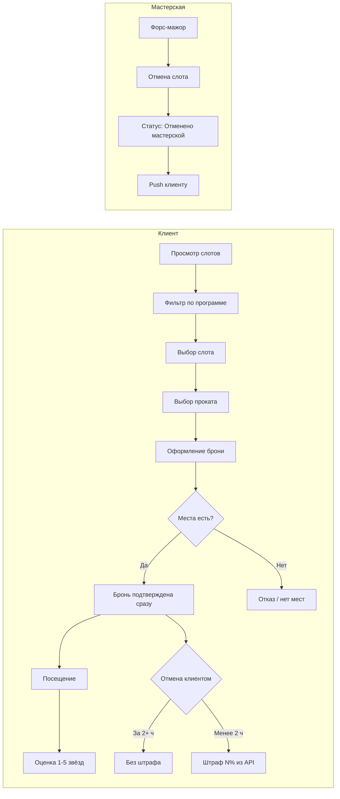

# Домен: гончарная мастерская «Гончарка»

## Контекст

Небольшая гончарная мастерская в центре города проводит групповые мастер-классы по лепке и работе на гончарном круге. Сейчас запись ведётся вручную через Instagram и ежедневник владелицы, что приводит к двойным бронированиям, путанице в выходные и простою ресурсов (мест, глины, мастеров).

Цель цифровизации — дать **клиенту** возможность самостоятельно просматривать расписание и бронировать занятия, а владельцу — снизить операционную нагрузку. Администрирование расписания, мастеров и слотов остаётся в **существующей инфраструктуре** (вне текущей поставки).

## Границы текущей поставки

| В скоупе | Вне скоупа |
| --- | --- |
| Клиентское **веб-приложение** (Vue.js SPA), адаптивное | Нативное мобильное приложение |
| **Клиентский API** (контракт для веб-приложения) | Существующий бэкенд мастерской, админка, интерфейсы мастера и владельца |
| Сценарии роли **Клиент** | Создание и редактирование расписания, мастеров, слотов в клиенте |
| Чтение слотов, программ, мастеров; бронь, отмена, оценки, подписка на уведомления | Гарантия «0 двойных броней», транзакционность, SLA, маппинг на внутренние модели бэкенда |
| Обработка ответов и ошибок API (в т.ч. отказ при отсутствии мест) | Взыскание штрафа и офлайн-оплата на стороне мастерской |
| Отображение статуса «Отменено мастерской», Web Push при форс-мажоре | Действие отмены слота организатором |

## Техническая архитектура

### Компоненты

```text
[Браузер: Vue.js SPA]  ←→  [Клиентский API]  ←→  [Существующий бэкенд мастерской]
   адаптивный сайт             контракт OpenAPI         black-box, источник истины
```

- **Vue.js SPA** — одностраничный веб-сайт для клиента. Открывается в браузере на телефоне, планшете и компьютере; интерфейс адаптивный, без требования нативной оболочки.
- **Клиентский API** — HTTP API, с которым работает веб-приложение. Его **контракт** (OpenAPI) — каноническая схема данных для текущей поставки.
- **Существующий бэкенд** — уже реализованная инфраструктура мастерской (расписание, мастера, админка). Для веб-приложения — **black-box**: детали реализации, транзакционность и внутренние модели **вне скоупа**.

Проект **учебный/тестовый**: исторических данных и легаси-схемы нет; миграция и backfill старых данных не требуются.

### Граница ответственности (R-004)

| Область | Клиент (Vue.js) | Сервер (API / бэкенд) |
| --- | --- | --- |
| Двойные брони | Показывает результат; обрабатывает отказ API | Атомарная проверка мест при бронировании |
| Слоты, программы, мастера | Только чтение и отображение | Формирование расписания, лимиты вместимости |
| Бронь | Запрос, отображение статуса | Подтверждение, резервирование места |
| Отмена | Запрос отмены, показ % штрафа и суммы из API | Расчёт штрафа, порог 2 ч, настройка % (сейчас 50%) |
| Прокат | Выбор «своё / прокат» в UI | Тариф, свободный фонд инструментов |
| Оценка мастера | Форма 1–5 звёзд | Сохранение, привязка к брони |
| Уведомления | Web Push в браузере, запрос разрешения | Отправка напоминаний и push при отмене мастерской |
| Аутентификация | Экран входа, ввод телефона и SMS-кода | Верификация, выдача сессии/токена |

Клиент **не дублирует** бизнес-правила, которые обеспечивает сервер (лимит мест, штраф, доступность слота). При ошибке API — понятное сообщение пользователю (например, «мест уже нет»).

### Данные контракта API (R-015)

Бэкенд по условию отдаёт поля, описанные в контракте, в том числе:

- слот: время, программа, мастер, свободные места, цена, длительность, описание, адрес, статус;
- программа занятия;
- мастер (включая фото);
- прокат: тариф, свободный фонд;
- бронь: статусы (подтверждена, отменена клиентом, отменена мастерской и др.);
- правила отмены: порог в часах, настраиваемый % штрафа (не константа в клиенте);
- причина отмены мастерской.

### Ключевые технические решения MVP

- **Аутентификация:** телефон + SMS-код (через API).
- **Расписание по умолчанию:** слоты на 7 дней (R-027); фильтр дат — до месяца; фильтр по программе на клиенте.
- **Уведомления:** Web Push (Service Worker); напоминания о записи и push при «Отменено мастерской» (R-008). Резервный канал — не уточнён.
- **Оплата:** офлайн; клиент только показывает цены из API, без платёжного шлюза в MVP.
- **Роли:** только **Клиент** (R-028); админка и интерфейс мастера — в существующей инфраструктуре.

### Обработка ошибок и граничных случаев

- Слот без мест — запись недоступна или отказ API с сообщением в UI.
- Слот отменён мастерской — повторная запись запрещена; статус и причина из API.
- Нет расписания на период — empty state «Пока нет доступных занятий».
- Поздняя отмена — подтверждение с отображением штрафа из API перед отправкой запроса.

## Участники (акторы)

### Клиент
Человек, который хочет посетить мастер-класс. Основной пользователь разрабатываемого веб-приложения. **Входит по телефону + SMS-коду.** Взаимодействует с расписанием (фильтр по программе), оформляет и отменяет бронь (**одна бронь = один человек**, подтверждение сразу), выбирает прокат инструментов, оставляет **оценку 1–5 звёзд** мастеру после занятия.

### Мастер
Проводит занятие. Привязан к слоту в расписании. Клиент может оценивать мастера после посещения. Управление мастерами — в существующей инфраструктуре; в текущей поставке клиент только **видит**, кто ведёт занятие.

### Владелец / администратор (Марина)
Управляет мастерской, расписанием и исключительными ситуациями через **существующую админку**. В клиентском приложении не представлена как роль.

### Мастерская (организатор)
Юридическое и операционное лицо, отменяющее занятия при форс-мажоре (поломка печи, отключение электричества). При отмене со стороны мастерской бронь клиента переходит в статус **«Отменено мастерской»** с причиной; повторная запись на тот же слот запрещена.

## Ключевые сущности

### Программа занятия
Тип мастер-класса с разной сложностью и форматом:

- **Лепка для новичков** — больше внимания каждому участнику; группа до **6 человек**.
- **Работа на гончарном круге** — для тех, кто уже пробовал.

Программа определяет содержание занятия, ограничения по размеру группы и, вероятно, требования к оборудованию.

### Слот (занятие в расписании)
Конкретное занятие в календаре. **Один слот = одна группа = один мастер** (параллельных групп в одно время нет).

Атрибуты, видимые клиенту:

- дата и время начала;
- длительность порядка **2–2,5 часа**;
- программа и её описание;
- назначенный мастер (с фото);
- количество **свободных мест** (занятые слоты **тоже показываются**, с пометкой «мест нет»);
- **цена** занятия;
- **адрес** мастерской;
- статус (доступен для записи, отменён мастерской и т.д.).

По умолчанию клиенту показываются слоты на **ближайшие 7 дней** (горизонт планирования расписания в бэкенде); через фильтр дат — до **месяца** вперёд. Сортировка по умолчанию — **дата и время**. Фильтр по **программе** (новички / круг). Лист ожидания не предусмотрен. При отсутствии слотов — empty state «Пока нет доступных занятий».

### Ресурсы мастерской
Ограничения, влияющие на вместимость:

- **10 гончарных кругов** в целом по мастерской;
- для новичковых групп — не более **6 участников** независимо от общего числа кругов.

Логика согласования ресурсов при бронировании — на стороне бэкенда.

### Бронь (запись клиента)
Связь **одного клиента** с **одним местом** в слоте. Подтверждается **сразу** после успешного ответа API (без ручной модерации). Включает выбор:

- **свои** инструменты и фартук **или**
- **прокат** со стороны мастерской.

Свободный прокатный фонд и тариф проката приходят из API. Атомарная проверка мест при создании брони — на бэкенде. **Цена** занятия (и доплата за прокат) **отображается до записи**; оплата в MVP — **офлайн** (наличные / перевод).

### Правило отмены и штраф
Параметры приходят из бэкенда (не захардкожены в клиенте):

- отмена **не позднее чем за 2 часа** до начала — без штрафа, место освобождается;
- отмена **менее чем за 2 часа** — **штраф** в процентах от стоимости занятия (текущее значение в настройках: **50%**).

Клиент при отмене видит актуальный % и расчётную сумму штрафа из API.

### Оценка мастера
Обратная связь клиента **после** посещения занятия. **Шкала 1–5 звёзд**, в MVP. Нужна владельцу для понимания качества работы мастеров (в т.ч. «звёзд» и новичков среди мастеров).

### Уведомление
Канал информирования клиента в MVP: **напоминания о записи** и **push при отмене мастерской**. Для веб-приложения — **браузерные push** (Web Push); резервный канал не уточнён.

## Основные бизнес-процессы



### Запись на занятие
1. Клиент входит (телефон + SMS), открывает расписание (7 дней по умолчанию, до месяца через фильтр дат).
2. Фильтрует по программе; слоты отсортированы по дате и времени.
3. Видит слоты (включая полностью занятые — «мест нет»): время, программу, мастера, цену, места и прочие поля карточки.
4. Выбирает слот и указывает, нужен ли прокат инструментов/фартука.
5. Оформляет бронь на себя; бэкенд атомарно резервирует место или возвращает отказ. Подтверждение — **сразу**.

### Отмена клиентом
- **За 2+ часа** до начала — без штрафа, место освобождается.
- **Менее чем за 2 часа** — штраф **N%** от стоимости (N из API, сейчас 50%); клиент видит расчёт перед подтверждением отмены.

> В исходном брифе Марина упоминала проблему отмены «за 10 минут» — в выявлении требований зафиксирован порог **2 часа** и штраф вместо жёсткого запрета.

### Отмена мастерской (форс-мажор)
Слот отменяется в существующей инфраструктуре. У клиента бронь **не удаляется**, а получает статус **«Отменено мастерской»** с причиной. Клиент получает push. Повторная запись на этот слот **невозможна**.

### Оценка после занятия
После проведённого занятия клиент ставит оценку **1–5 звёзд** (MVP).

## Ограничения и нефункциональные ожидания

- **Срок:** к началу осеннего сезона (~2 месяца).
- **Бюджет:** ограниченный; приоритет — MVP, «навороты» позже.
- **Must-have MVP:** расписание, запись, отмена, фильтр по программе.
- **Клиент:** Vue.js SPA, адаптивная вёрстка для экранов от смартфона до десктопа; целевые браузеры — актуальные Chrome, Safari, Firefox, Edge (десктоп и мобильные).
- **Интеграция:** REST (или эквивалент) по контракту OpenAPI; без дублирования серверной бизнес-логики в UI.
- **Оплата:** офлайн в MVP; цены из API, платёжный шлюз не подключается.
- **Лояльность:** не в MVP (отложена).

## Открытые зоны домена

Большинство пробелов брифа закрыты в ходе сессии выявления — см. [02-elicitation-qa.md](./02-elicitation-qa.md).

Остаются без детализации (не блокируют MVP):

- детали проката (состав, частичный прокат, смена выбора после брони);
- неявка (no-show) и опоздание;
- резервный канал уведомлений при отказе от browser push.

## Связанные артефакты

| Файл | Содержание |
| --- | --- |
| [02-elicitation-qa.md](./02-elicitation-qa.md) | Вопросы и ответы заказчика (выявление требований) |
