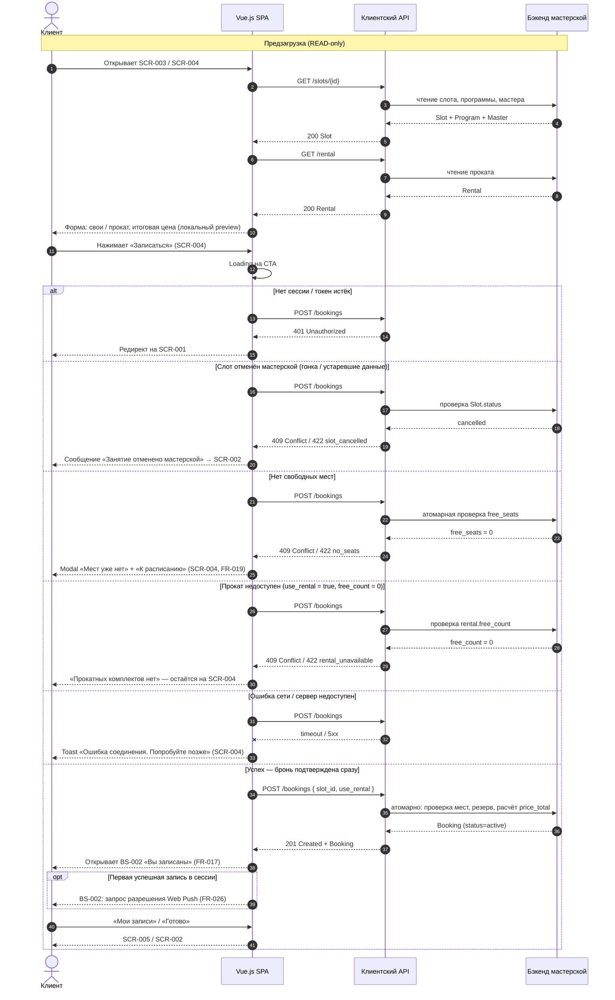

# Sequence-диаграммы API

Этап 4. Проектирование. Взаимодействие **клиентского сайта (Vue.js SPA)** с **клиентским API**
при ключевых сценариях. Существующий бэкенд мастерской — black-box за API (NFR-007).

**Источники:** [UC-004](../2-requirements/use-cases.md) · [data-model.md](./data-model.md) ·
[scr-004-booking.md](../3-design-brief/scr-004-booking.md) · [BS-002-booking-success.md](../3-design-brief/BS-002-booking-success.md)

---

## createBooking — создание брони

Сценарий: клиент на SCR-004 подтверждает запись на выбранный слот (UC-004, FR-013…FR-019).

**Предусловия:** аутентифицированная сессия; слот `scheduled`; в UI слот доступен для записи.

**Запрос (концептуально):**

```http
POST /api/bookings
Authorization: Bearer <token>
Content-Type: application/json

{
  "slot_id": "<uuid>",
  "use_rental": true
}
```

**Успешный ответ:** `201 Created` + тело `Booking` (`status: active`, `price_total`, вложенный `slot`).

---

### Диаграмма с ветками



---

### Ветки и коды ответа (сводка)

| Ветка | HTTP | Действие SPA | Требования |
| --- | --- | --- | --- |
| Успех | `201` | BS-002, обновление списка записей | FR-017, BR-006 |
| Нет мест | `409` / `422` | Modal на SCR-004 | FR-018, FR-019 |
| Слот отменён | `409` / `422` | Сообщение + возврат к расписанию | FR-024, FR-023 |
| Прокат недоступен | `409` / `422` | Остаётся на SCR-004, смена выбора | FR-016 |
| Не авторизован | `401` | SCR-001 | FR-002 |
| Сеть / 5xx | — / `5xx` | Toast, повтор | FR-029 |

Точные коды и тела ошибок — в контракте OpenAPI; клиент показывает **понятные тексты**,
не технические детали (NFR-003, FR-029).

---

### Что меняется в данных (успешная ветка)

| Сущность | Операция | Кто |
| --- | --- | --- |
| **Booking** | CREATE (`status = active`) | API / бэкенд |
| **Slot** | READ → обновление `free_seats` (−1) | Бэкенд |
| **Rental** | READ → при `use_rental`: `free_count` (−1) | Бэкенд |
| Program, Master, Client | без изменений со стороны сайта | — |

Сайт **не пишет** в Slot/Rental напрямую — только `POST /bookings`; денормализованные
счётчики обновляет бэкенд атомарно.

---

### Экранная трассировка

| Шаг | Экран / компонент |
| --- | --- |
| Выбор слота | SCR-002 → SCR-003 |
| Форма брони | SCR-004 |
| Успех | BS-002 |
| Ошибка «нет мест» | SCR-004 (modal) |
| Список после записи | SCR-005 |

---

## Связанные артефакты

| Артефакт | Связь |
| --- | --- |
| [data-model.md](./data-model.md) | Сущности Booking, Slot, Rental |
| [use-cases.md](../2-requirements/use-cases.md) | UC-004 Бронирование занятия |
| [functional-requirements.md](../2-requirements/functional-requirements.md) | FR-013…FR-019 |
