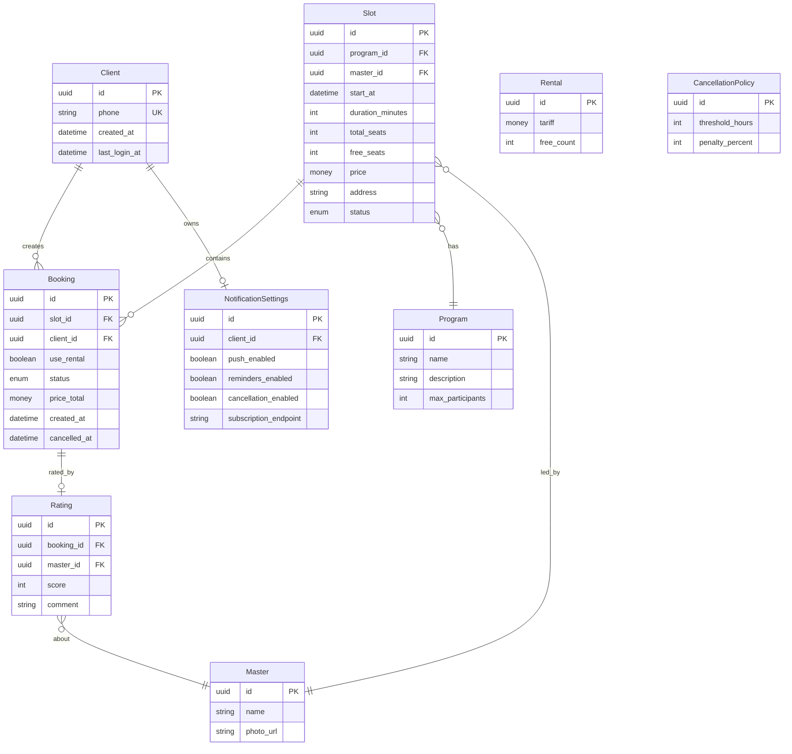
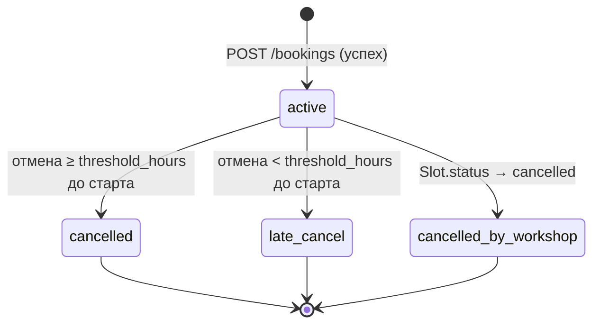
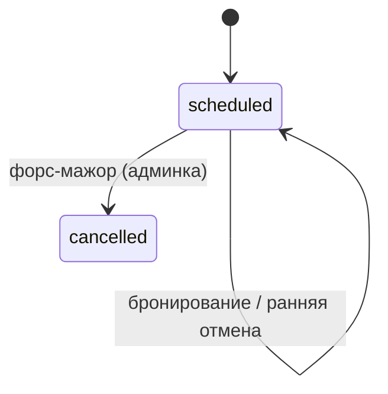

# Модель данных

Этап 4. Проектирование. Ресурсная модель **клиентского API** (контракт OpenAPI) — что сайт
читает и что меняет. Это не схема БД бэкенда мастерской: хранение, транзакционность и
внутренние модели — black-box ([01-domain.md](../1-elicitation/01-domain.md), NFR-007).

**Источники:** [01-domain.md](../1-elicitation/01-domain.md) · [functional-requirements.md](../2-requirements/functional-requirements.md) · [business-requirements.md](../2-requirements/business-requirements.md) · [use-cases.md](../2-requirements/use-cases.md)

---

## Доступ клиентского сайта к сущностям

| Сущность | Операции сайта | Кто владеет данными | Примечание |
| --- | --- | --- | --- |
| **Program** | **READ** | Бэкенд мастерской | Справочник программ |
| **Master** | **READ** | Бэкенд мастерской | Справочник мастеров |
| **Slot** | **READ** | Бэкенд мастерской | Расписание формируется в админке |
| **Rental** | **READ** | Бэкенд мастерской | Тариф и свободный фонд проката |
| **CancellationPolicy** | **READ** | Бэкенд мастерской | Порог 2 ч и % штрафа (NFR-010) |
| **Client** | **READ** (профиль) | Клиентский API / бэкенд | Создаётся при первом входе (телефон + SMS) |
| **Booking** | **CREATE**, **READ**, **UPDATE** (отмена) | Клиентский API | Одна бронь = одно место (FR-013) |
| **Rating** | **CREATE**, **READ** | Клиентский API | Одна оценка на бронь в MVP |
| **NotificationSettings** | **READ**, **CREATE**, **UPDATE** | Клиентский API | Web Push-подписка и тогглы |

OTP-код и сессия/токен аутентификации в ER-модель не входят: это транзиентные артефакты
потока входа (FR-001, FR-002).

---

## Сущности и атрибуты

### Client (Клиент)

| Атрибут | Тип | Описание |
| --- | --- | --- |
| `id` | UUID (PK) | Идентификатор клиента |
| `phone` | string (unique) | Номер телефона — логин |
| `created_at` | datetime | Дата регистрации |
| `last_login_at` | datetime? | Последний вход |

Сайт **читает** профиль (телефон) после аутентификации. Регистрация/обновление `last_login_at`
выполняется бэкендом при успешной верификации SMS — не отдельным экраном редактирования (SCR-007).

---

### Program (Программа занятия) — READ-only

| Атрибут | Тип | Описание |
| --- | --- | --- |
| `id` | UUID (PK) | Идентификатор программы |
| `name` | string | «Лепка для новичков», «Гончарный круг» |
| `description` | string? | Описание для карточки слота (SCR-003) |
| `max_participants` | int | Лимит группы (например, 6 для новичков) |

---

### Master (Мастер) — READ-only

| Атрибут | Тип | Описание |
| --- | --- | --- |
| `id` | UUID (PK) | Идентификатор мастера |
| `name` | string | Имя мастера |
| `photo_url` | string? | URL фото (FR-012) |

---

### Slot (Слот занятия) — READ-only

Конкретное занятие в расписании. Один слот = одна группа = один мастер.

| Атрибут | Тип | Описание |
| --- | --- | --- |
| `id` | UUID (PK) | Идентификатор слота |
| `program_id` | FK → Program | Программа |
| `master_id` | FK → Master | Мастер |
| `start_at` | datetime (UTC) | Старт; отображение в локальной зоне; порог отмены считает сервер (BR-008) |
| `duration_minutes` | int | Длительность, мин (≈120–150) |
| `total_seats` | int | Всего мест |
| `free_seats` | int | Свободно мест (денормализовано бэкендом) |
| `price` | money (RUB) | Цена за место |
| `address` | string | Адрес мастерской |
| `description` | string? | Краткое описание занятия |
| `status` | enum | `scheduled` \| `cancelled` |
| `cancellation_reason` | string? | Причина, если `status = cancelled` |

При `free_seats = 0` слот показывается с пометкой «Мест нет» (FR-009). При `status = cancelled`
запись запрещена (FR-024).

---

### Rental (Прокат) — READ-only

Сквозной ресурс мастерской (не привязан к конкретному слоту в контракте).

| Атрибут | Тип | Описание |
| --- | --- | --- |
| `id` | UUID (PK) | Идентификатор |
| `tariff` | money (RUB) | Доплата за комплект инструментов и фартука |
| `free_count` | int | Свободный фонд комплектов |

Итог брони: `slot.price + (rental.tariff, если use_rental = true)`. Расчёт и фиксация
`price_total` — на сервере (FR-015, FR-016).

---

### Booking (Бронь / запись)

| Атрибут | Тип | Описание |
| --- | --- | --- |
| `id` | UUID (PK) | Идентификатор записи |
| `slot_id` | FK → Slot | Слот |
| `client_id` | FK → Client | Клиент |
| `use_rental` | boolean | `true` — прокат; `false` — свои инструменты (FR-014) |
| `status` | enum | `active` \| `cancelled` \| `late_cancel` \| `cancelled_by_workshop` |
| `price_total` | money (RUB), read-only | Итог от сервера; фиксируется при создании |
| `created_at` | datetime | Время создания |
| `cancelled_at` | datetime? | Время отмены |
| `cancellation_reason` | string? | Причина отмены мастерской (`cancelled_by_workshop`) |

Сайт **создаёт** бронь (`POST`), **читает** список и детали, **инициирует отмену**
(`POST`/`PATCH` — смена статуса на `cancelled` или `late_cancel`). Удаления нет.

«Прошедшая» запись — не статус в БД, а производное отображение: `slot.start_at` в прошлом
(SCR-005, SCR-006).

---

### Rating (Оценка мастера)

| Атрибут | Тип | Описание |
| --- | --- | --- |
| `id` | UUID (PK) | Идентификатор |
| `booking_id` | FK → Booking (unique) | Одна оценка на бронь в MVP |
| `master_id` | FK → Master | Мастер занятия |
| `score` | int (1–5) | Звёзды (FR-025) |
| `comment` | string? | Комментарий (SCR-008) |
| `created_at` | datetime | Время создания |

Сайт **создаёт** оценку после посещения; повторное изменение в MVP недоступно.

---

### CancellationPolicy (Правила отмены) — READ-only

| Атрибут | Тип | Описание |
| --- | --- | --- |
| `id` | UUID (PK) | Идентификатор |
| `threshold_hours` | int | Порог без штрафа (2) |
| `penalty_percent` | int | % штрафа при поздней отмене (50) |

Клиент **не хранит** константы — только отображает значения из API (NFR-010, BR-008).
При отмене сервер возвращает расчёт штрафа для подтверждения (FR-021, FR-022).

---

### NotificationSettings (Настройки уведомлений)

| Атрибут | Тип | Описание |
| --- | --- | --- |
| `id` | UUID (PK) | Идентификатор |
| `client_id` | FK → Client | Владелец |
| `push_enabled` | boolean | Push включён |
| `reminders_enabled` | boolean | Напоминания о записи (FR-027) |
| `cancellation_enabled` | boolean | Push при отмене мастерской (FR-028) |
| `subscription_endpoint` | string? | Web Push endpoint (Service Worker) |

Сайт **читает** и **обновляет** настройки (SCR-009). Запрос разрешения браузера — после
первой успешной записи (BS-002, foundations §8.1).

---

## ER-диаграмма

> **Rental** и **CancellationPolicy** на диаграмме не связаны FK с другими сущностями:
> приходят как справочники/синглтоны API и используются при расчёте брони и отмены.

---

## Жизненный цикл Booking

| Из | Событие | В | Эффект на слот |
| --- | --- | --- | --- |
| — | Успешное создание | `active` | `free_seats -= 1`; при `use_rental` — `rental.free_count -= 1` |
| `active` | Ранняя отмена (≥ 2 ч) | `cancelled` | Место и прокат возвращаются |
| `active` | Поздняя отмена (< 2 ч) | `late_cancel` | Место и прокат **не** освобождаются; штраф N% |
| `active` | Отмена мастерской | `cancelled_by_workshop` | Слот снят; push клиенту (FR-028) |

Граница «ровно 2 часа» — ранняя отмена (≥ 2 ч, BR-008). Отмена недоступна после `start_at`
(SCR-006).

---

## Жизненный цикл Slot (READ-only для сайта)

| `status` | Запись клиентом |
| --- | --- |
| `scheduled`, `free_seats > 0` | Доступна |
| `scheduled`, `free_seats = 0` | Показан, CTA «Мест нет» |
| `cancelled` | Запрещена (FR-024) |

---

## Инварианты (целостность на стороне API)

1. `Slot.free_seats = total_seats − count(active bookings)` — при `late_cancel` место не возвращается.
2. `Rental.free_count` уменьшается только при `use_rental = true`; при поздней отмене не возвращается.
3. Одна бронь = один клиент = одно место (FR-013, BR-006).
4. Повторная запись на слот с `status = cancelled` запрещена (FR-024).
5. Создание брони атомарно: параллельные запросы не дают овербукинг (NFR-007, BR-015).
6. `price_total` и штраф при отмене рассчитывает сервер; клиент не дублирует логику (NFR-009).

---

## Связанные артефакты

| Артефакт | Связь |
| --- | --- |
| [api-sequence.md](./api-sequence.md) | Sequence-диаграмма `createBooking` |
| [01-domain.md](../1-elicitation/01-domain.md) | Доменные сущности и границы |
| [SCREENS_REGISTRY.md](../3-design-brief/SCREENS_REGISTRY.md) | Экраны, использующие поля модели |
| [scr-004-booking.md](../3-design-brief/scr-004-booking.md) | UI создания брони |
| [scr-005-my-bookings.md](../3-design-brief/scr-005-my-bookings.md) | Статусы и список записей |
