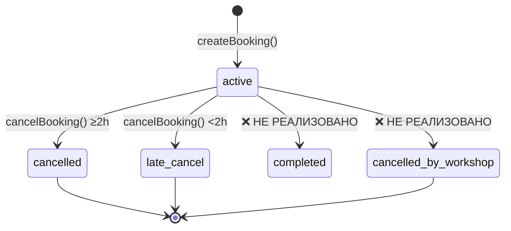

# Exploratory Testing · Отчёт о багах

**Продукт:** Гончарная мастерская «Гончарка» (клиент Vue.js SPA)  
**Область:** `development/pottery/src`  
**Дата:** 2026-07-06  
**Методология:** Boundary Value Analysis, Error Guessing, State Transition Testing  
**Окружение:** Chrome/Edge (desktop), mock API + `localStorage` (`goncharka-demo-v1`), демо-код `1111`

---

## Сводка

| Severity | Кол-во |
|---|---|
| Critical | 4 |
| High | 8 |
| Medium | 6 |
| **Итого** | **18** |

**Фокусные области:**

| Область | Найдено |
|---|---|
| Обновление UI после записи/отмены | 3 |
| Статусы брони | 4 |
| Фильтрация расписания | 5 |
| Расчёт стоимости (прокат + занятие) | 2 |
| Прочее (краши, auth, UX) | 4 |

---

## BUG-001 · Статус `cancelled_by_workshop` никогда не присваивается брони

**Severity:** Critical  
**Область:** Статусы брони · State Transition  
**Файлы:** `src/api/mockApi.js`, `src/views/BookingDetailsView.vue`

### Описание проблемы

UI поддерживает статус брони «отменено мастерской» (баннер, бейдж, скрытие кнопки отмены), но API не переводит существующие брони в этот статус при отмене слота мастерской. Слот `s11` имеет `status: 'cancelled'`, однако связанные брони остаются `active`.

### Шаги воспроизведения

1. Войти в приложение (телефон любой, код `1111`).
2. Записаться на любой доступный слот.
3. В DevTools → Application → Local Storage → `goncharka-demo-v1` найти слот брони и установить `"status": "cancelled"`, `"cancellation_reason": "Тест"`.
4. Открыть «Мои записи» → детали этой брони.

### Ожидаемый результат

Бронь получает статус `cancelled_by_workshop`, отображается причина отмены, кнопка «Отменить запись» скрыта (FR-023, UC-006).

### Фактический результат

Статус брони остаётся `active`, баннер «Занятие отменено мастерской» не показывается (условие `booking.status === 'cancelled_by_workshop'` ложно).

### Причина

В `mockApi.js` нет логики синхронизации статуса брони при отмене слота. Статус `cancelled_by_workshop` существует только в UI (`StatusBadge.vue`, `BookingDetailsView.vue`).

### Предлагаемое решение

При отмене слота мастерской (на стороне API) обновлять все связанные активные брони:

```javascript
db.bookings
  .filter(b => b.slot_id === slot.id && b.status === 'active')
  .forEach(b => {
    b.status = 'cancelled_by_workshop'
    b.cancellation_reason = slot.cancellation_reason
  })
```

---

## BUG-002 · Штраф при поздней отмене не учитывает стоимость проката

**Severity:** Critical  
**Область:** Расчёт стоимости · Boundary Value Analysis  
**Файлы:** `src/api/mockApi.js` (строка 201), `src/components/CancelConfirmModal.vue`

### Описание проблемы

При поздней отмене (< 2 ч) штраф рассчитывается как `%` только от цены занятия (`slot.price`), хотя клиент оплатил `price_total` (занятие + прокат 150 ₽). В модалке сверху показывается полная сумма, а штраф — от урезанной базы.

### Шаги воспроизведения

1. Войти в приложение.
2. Записаться на слот с прокатом (итого 1 350 ₽ при цене занятия 1 200 ₽).
3. Через DevTools сдвинуть `start_at` слота на +1,5 ч от текущего времени.
4. Открыть детали записи → «Отменить запись».

### Ожидаемый результат

Штраф 50% от полной стоимости брони: **675 ₽** (от 1 350 ₽) — согласно формулировке «% от стоимости» при отображении `price_total` в модалке.

### Фактический результат

Штраф **600 ₽** (50% от 1 200 ₽). Прокат 150 ₽ в расчёт не входит.

**Подтверждено скриптом:** `penalty_amount = Math.round(booking.slot.price * 50 / 100)` при `price_total = 1350`.

### Причина

```201:201:development/pottery/src/api/mockApi.js
  const penalty_amount = isLate ? Math.round(booking.slot.price * policy.penalty_percent / 100) : 0
```

Используется `booking.slot.price` вместо `booking.price_total`.

### Предлагаемое решение

```javascript
const penalty_amount = isLate
  ? Math.round(booking.price_total * policy.penalty_percent / 100)
  : 0
```

Уточнить бизнес-правило с аналитикой: штраф от занятия или от полной суммы с прокатом.

---

## BUG-003 · Дублирование активных броней одним клиентом на один слот

**Severity:** Critical  
**Область:** Бронирование · Error Guessing  
**Файлы:** `src/api/mockApi.js` (`createBooking`)

### Описание проблемы

Клиент может создать несколько активных броней на один и тот же слот. Нет проверки «один клиент — одна бронь на слот». При быстром двойном клике «Записаться» возможны две параллельные брони.

### Шаги воспроизведения

1. Войти в приложение.
2. Открыть доступный слот → «Записаться» → подтвердить запись.
3. Вернуться к тому же слоту и записаться повторно (или двойной клик по «Записаться»).

### Ожидаемый результат

Вторая запись отклоняется: «У вас уже есть запись на это занятие» (FR-013: одна бронь = одно место **на клиента**).

### Фактический результат

Создаются 2+ активных брони на один слот одним пользователем; `free_seats` уменьшается при каждой брони.

**Подтверждено:** API-тест — 2 активные брони на `s1` у одного `client_id`.

### Причина

`createBooking` проверяет только `free_seats`, но не наличие существующей активной брони клиента на этот `slot_id`.

### Предлагаемое решение

```javascript
const existing = db.bookings.find(
  b => b.client_id === user.id && b.slot_id === slot_id && b.status === 'active'
)
if (existing) throw statusError('already_booked', 'У вас уже есть запись на это занятие')
```

На UI: debounce/disabled кнопки уже есть (`saving`), но нужна серверная (API) защита.

---

## BUG-004 · `toDateInput` возвращает UTC-дату, сдвинутую на −1 день (UTC+3)

**Severity:** Critical  
**Область:** Фильтрация расписания · Boundary Value Analysis  
**Файлы:** `src/utils/format.js` (строки 44–46), `src/views/ScheduleView.vue`

### Описание проблемы

Функция `toDateInput` использует `toISOString().slice(0, 10)`, что даёт дату в UTC, а не локальную. В часовом поясе UTC+3 локальная полночь 6 июля превращается в `2026-07-05`.

### Шаги воспроизведения

1. Открыть расписание в браузере с TZ UTC+3 (Москва).
2. Проверить значение фильтра «Дата старта» по умолчанию утром 6 июля.
3. Сравнить с системной датой.

### Ожидаемый результат

Поле «С» показывает **2026-07-06** (локальная дата).

### Фактический результат

Поле «С» показывает **2026-07-05**.

**Подтверждено:** `toDateInput(localMidnight 06.07.2026) → "2026-07-05"`.

### Причина

```44:46:development/pottery/src/utils/format.js
export function toDateInput(date) {
  return new Date(date).toISOString().slice(0, 10)
}
```

### Предлагаемое решение

```javascript
export function toDateInput(date) {
  const d = new Date(date)
  const pad = n => String(n).padStart(2, '0')
  return `${d.getFullYear()}-${pad(d.getMonth() + 1)}-${pad(d.getDate())}`
}
```

---

## BUG-005 · Фильтр по дате парсит строку как UTC midnight — слоты на границе дня пропадают

**Severity:** High  
**Область:** Фильтрация расписания · Boundary Value Analysis  
**Файлы:** `src/api/mockApi.js` (строки 143–146), `src/views/ScheduleView.vue`

### Описание проблемы

Фильтр передаёт даты как `"YYYY-MM-DD"`. `new Date("2026-07-06")` интерпретируется как **00:00 UTC** (= 03:00 MSK). Слоты раньше 03:00 по Москве в этот день отфильтровываются. Быстрые чипы дней используют `toDateInput` (BUG-004), усиливая рассинхрон.

### Шаги воспроизведения

1. Создать слот с `start_at` = сегодня 02:00 MSK (через DevTools).
2. Нажать чип «Сегодня» на расписании.
3. Проверить наличие слота в списке.

### Ожидаемый результат

Слот на выбранный календарный день (локальный) отображается.

### Фактический результат

Слот до 03:00 MSK не попадает в выборку.

### Причина

Сравнение ISO-времени слота с UTC-полуночью строки даты без учёта локального TZ.

### Предлагаемое решение

Парсить даты в локальной TZ:

```javascript
function startOfLocalDay(dateStr) {
  const [y, m, d] = dateStr.split('-').map(Number)
  return new Date(y, m - 1, d, 0, 0, 0, 0)
}
function endOfLocalDay(dateStr) {
  const [y, m, d] = dateStr.split('-').map(Number)
  return new Date(y, m - 1, d, 23, 59, 59, 999)
}
```

---

## BUG-006 · Краш `BookingView` при ошибке загрузки слота

**Severity:** High  
**Область:** Error Guessing  
**Файлы:** `src/views/BookingView.vue` (строки 10, 22–29)

### Описание проблемы

`onMounted` загружает слот без `try/catch`. При ошибке API (`not_found`, сеть) `slot` остаётся `null`, но шаблон обращается к `slot.program.name` → runtime error.

### Шаги воспроизведения

1. Авторизоваться.
2. Перейти на бронирование с несуществующим id (через DevTools: `navigate('booking', { id: 'invalid' })` или испортить id в state).
3. Дождаться загрузки.

### Ожидаемый результат

Сообщение об ошибке «Слот не найден» + кнопка «Назад».

### Фактический результат

Белый экран / ошибка Vue: `Cannot read properties of null (reading 'program')`.

### Причина

```10:10:development/pottery/src/views/BookingView.vue
onMounted(async()=>{ slot.value = await getSlot(props.id); rental.value = await getRental(); loading.value=false })
```

Нет обработки исключения; `v-else` рендерится при `loading=false` даже если `slot=null`.

### Предлагаемое решение

Добавить `error` ref, `try/catch`, условие `v-else-if="slot"` и fallback UI.

---

## BUG-007 · Краш `CancelConfirmModal` при ошибке предпросмотра отмены

**Severity:** High  
**Область:** Отмена · Error Guessing  
**Файлы:** `src/components/CancelConfirmModal.vue` (строки 9, 16)

### Описание проблемы

`previewCancelBooking` вызывается без `try/catch`. При ошибке `data` остаётся `null`, шаблон обращается к `data.booking.slot.start_at`.

### Шаги воспроизведения

1. Открыть модалку отмены для несуществующей/чужой брони.
2. Или симулировать сбой API.

### Ожидаемый результат

Toast/сообщение «Не удалось загрузить условия отмены» + кнопка закрытия.

### Фактический результат

Краш модального окна.

### Причина

Отсутствие обработки ошибок в `onMounted`.

### Предлагаемое решение

Обернуть в `try/catch`, добавить состояние `error` и fallback UI.

---

## BUG-008 · Дефолтный период расписания 30 дней вместо 7 (расхождение с FR-004)

**Severity:** High  
**Область:** Фильтрация расписания · Boundary Value Analysis  
**Файлы:** `src/api/mockApi.js` (строка 144), `src/views/ScheduleView.vue` (строки 16–17, 66)

### Описание проблемы

По умолчанию загружаются слоты на 30 дней вперёд, тогда как FR-004 и README требуют **7 дней**.

### Шаги воспроизведения

1. Войти → открыть «Расписание» без фильтров.
2. Прокрутить список / проверить слот `s13` (+25 дней).

### Ожидаемый результат

Слоты только на ближайшие 7 дней.

### Фактический результат

Слоты до +30 дней (например, `s13` на +25 дней виден). Подзаголовок: «Слоты на ближайший месяц».

### Причина

```144:144:development/pottery/src/api/mockApi.js
  const to = filters.to ? new Date(filters.to) : new Date(Date.now() + 30 * 86400000)
```

`defaultTo` в ScheduleView также +30 дней.

### Предлагаемое решение

Изменить дефолт на 7 дней в API и UI; синхронизировать с FR-004.

---

## BUG-009 · Расписание не обновляется после записи при возврате «Назад» (устаревшие места)

**Severity:** High  
**Область:** Обновление UI после действий · State Transition  
**Файлы:** `src/views/SlotDetailsView.vue`, `src/App.vue`

### Описание проблемы

Если после успешной записи пользователь закрывает модалку «Готово» (расписание обновляется), но затем через «Мои записи» возвращается к **ранее открытой** вкладке/истории браузера — или если пользователь идёт slot → book → «‹ Назад» **до** submit: счётчик мест на `SlotDetailsView` не перезапрашивается при повторном входе на тот же слот **в рамках одной сессии без remount**.

Более воспроизводимый сценарий: открыть слот (3 места) → перейти к бронированию → в **другой вкладке** забронировать последнее место → вернуться в первой вкладке → «Записаться».

### Шаги воспроизведения

1. Вкладка A: открыть слот с 1 свободным местом, перейти на экран бронирования (не submit).
2. Вкладка B: забронировать это место.
3. Вкладка A: нажать «Записаться».

### Ожидаемый результат

UI показывает актуальное «Мест нет» до submit или при открытии экрана.

### Фактический результат

Кнопка «Записаться» активна (данные загружены при mount); при submit — modal «Мест уже нет» (ошибка только post-factum).

### Причина

Данные слота/проката загружаются один раз в `onMounted`, нет refetch при focus/revisit.

### Предлагаемое решение

Refetch при `visibilitychange` / перед submit; или optimistic lock с актуальным `getSlot` в `submit()`.

---

## BUG-010 · `MyBookingsView`: необработанная ошибка загрузки

**Severity:** High  
**Область:** Обновление UI · Error Guessing  
**Файлы:** `src/views/MyBookingsView.vue` (строки 8–9)

### Описание проблемы

`load()` не обёрнут в `try/catch`. При 401 (сессия сброшена) или повреждении `localStorage` — необработанное исключение, UI зависает на skeleton или пустом состоянии.

### Шаги воспроизведения

1. Авторизоваться → открыть «Мои записи».
2. В DevTools удалить `currentUser` из `goncharka-demo-v1`.
3. Нажать «Обновить».

### Ожидаемый результат

Редирект на login или сообщение об ошибке.

### Фактический результат

Unhandled promise rejection; `loading` может остаться `true` или список пуст без пояснения.

### Причина

```8:9:development/pottery/src/views/MyBookingsView.vue
async function load(){ loading.value=true; bookings.value = await getBookings(); loading.value=false }
```

### Предлагаемое решение

Добавить `try/catch/finally`, обработку 401, состояние `error`.

---

## BUG-011 · Прошедшие занятия остаются со статусом «активна» (разрыв state machine)

**Severity:** High  
**Область:** Статусы брони · State Transition Testing  
**Файлы:** `src/views/MyBookingsView.vue`, `src/api/mockApi.js`

### Описание проблемы

После окончания занятия статус брони не меняется на `completed`. Прошедшие брони попадают во вкладку «Прошедшие» с бейджем **«активна»**, что противоречит семантике статусов.

### Шаги воспроизведения

1. Записаться на занятие.
2. Через DevTools установить `start_at` слота в прошлое.
3. Открыть «Мои записи» → «Прошедшие».

### Ожидаемый результат

Статус «завершена» / «посещена» или автоматический переход `active → completed` после `start_at + duration`.

### Фактический результат

Бейдж «активна» во вкладке «Прошедшие».

### Причина

Нет перехода состояний `active → completed` в API; фильтр past использует только дату:

```11:11:development/pottery/src/views/MyBookingsView.vue
const past = computed(()=> bookings.value.filter(b => b.status !== 'active' || new Date(b.slot.start_at) <= new Date())
```

### Предлагаемое решение

Добавить статус `completed` в API (cron/при чтении) и `StatusBadge`; или отображать «активна» только в «Предстоящие».

---

## BUG-012 · Граница 2 часов: ровно 2ч 00мин — без штрафа (уточнить ожидание)

**Severity:** Medium  
**Область:** Отмена · Boundary Value Analysis  
**Файлы:** `src/api/mockApi.js` (строка 200)

### Описание проблемы

Порог поздней отмены: `hoursToStart < 2` (строго меньше). Ровно за 2 часа штрафа нет. UC-005 формулирует «< 2 ч» — поведение **может быть корректным**, но граница хрупкая: 1h 59m → штраф, 2h 00m → нет.

### Шаги воспроизведения

1. Создать бронь со стартом ровно через 2 часа.
2. Открыть модалку отмены.

### Ожидаемый результат

По UC-005: «≥ 2 ч до начала» → без штрафа. **OK.**

При трактовке «менее 2 часов» включительно — ожидался бы штраф.

### Фактический результат

`is_late = false`, штраф 0 ₽.

### Причина

Строгое сравнение `< threshold_hours`.

### Предлагаемое решение

Зафиксировать правило в тест-кейсах; при необходимости изменить на `<=` согласованно с API-контрактом.

---

## BUG-013 · Неспецифичные сообщения при ошибках бронирования

**Severity:** Medium  
**Область:** Бронирование · Error Guessing  
**Файлы:** `src/views/BookingView.vue` (строка 14)

### Описание проблемы

`submit()` обрабатывает только `no_seats`. Ошибки `slot_cancelled`, `rental_unavailable`, `not_found` показываются как generic toast с `e.message` или «Ошибка соединения».

### Шаги воспроизведения

1. Открыть бронирование слота, отменённого мастерской (`s11`).
2. Или выбрать прокат при `free_count = 0`.

### Ожидаемый результат

- `slot_cancelled`: «Занятие отменено мастерской»
- `rental_unavailable`: «Прокатных комплектов нет»

### Фактический результат

Сообщение «Занятие отменено мастерской» / «Прокатных комплектов нет» (из API message) — **частично OK**, но нет dedicated UI (modal) как для `no_seats`; при сетевой ошибке — misleading «Ошибка соединения» даже для 409.

### Причина

```14:14:development/pottery/src/views/BookingView.vue
catch(e) { if (e.code === 'no_seats') noSeats.value = true; else emit('toast', e.message || 'Ошибка соединения. Попробуйте позже') }
```

### Предлагаемое решение

Switch по `e.code` с отдельными модалками/сообщениями; различать HTTP/network vs business errors.

---

## BUG-014 · Фильтры не применяются до нажатия «Применить» (UX-ловушка)

**Severity:** Medium  
**Область:** Фильтрация расписания  
**Файлы:** `src/views/ScheduleView.vue`

### Описание проблемы

Изменение чипов программы, дат и checkbox «Только со свободными местами» не перезагружает список. Только кнопка «Применить» и быстрые чипы дней вызывают `load()`.

### Шаги воспроизведения

1. Открыть «Фильтры».
2. Выбрать «Гончарный круг».
3. Не нажимать «Применить» — закрыть панель.

### Ожидаемый результат (по BS-001 AC-003)

Индикатор активных фильтров + обновлённый список после применения.

### Фактический результат

Список не меняется; индикатор «●» на кнопке «Фильтры» загорается (через `activeFilters()`), создавая **ложное ощущение**, что фильтр уже действует.

### Причина

`toggleProgram` меняет state, но не вызывает `load()`.

### Предлагаемое решение

Auto-apply при изменении; или явный индикатор «Есть неприменённые изменения»; disable индикатора до «Применить».

---

## BUG-015 · `defaultFrom`/`defaultTo` замораживаются при инициализации SPA

**Severity:** Medium  
**Область:** Фильтрация · Boundary Value Analysis  
**Файлы:** `src/views/ScheduleView.vue` (строки 15–16)

### Описание проблемы

`defaultFrom` и `defaultTo` вычисляются один раз при создании компонента. Если SPA открыта через полночь, «Сбросить» вернёт вчерашний диапазон; `activeFilters()` некорректно определяет «дефолтность».

### Шаги воспроизведения

1. Открыть расписание 5 июля 23:55.
2. Дождаться 6 июля 00:05 (без перезагрузки).
3. Нажать «Сбросить фильтры».

### Ожидаемый результат

Диапазон обновляется на актуальный «сегодня + 7/30 дней».

### Фактический результат

Даты остаются от 5 июля.

### Причина

```15:16:development/pottery/src/views/ScheduleView.vue
const defaultFrom = toDateInput(new Date())
const defaultTo = toDateInput(new Date(Date.now() + 30 * 86400000))
```

Константы, не computed.

### Предлагаемое решение

Вычислять defaults в `reset()` через `new Date()` или использовать `computed`.

---

## BUG-016 · Поздняя отмена не возвращает прокатный комплект

**Severity:** Medium  
**Область:** Расчёт стоимости / State Transition  
**Файлы:** `src/api/mockApi.js` (строки 216–219)

### Описание проблемы

При ранней отмене прокат возвращается в фонд (`free_count += 1`). При поздней отмене (`late_cancel`) — место **и прокат не возвращаются**, хотя клиент платит штраф.

### Шаги воспроизведения

1. Записаться с прокатом (`free_count` уменьшается).
2. Сдвинуть слот на < 2 ч.
3. Отменить запись (поздняя отмена).
4. Проверить `rental.free_count`.

### Ожидаемый результат

Уточнить бизнес-правило: возврат проката при штрафе или удержание.

### Фактический результат

Прокатный комплект **не возвращается**; `free_count` остаётся уменьшенным.

### Причина

```216:219:development/pottery/src/api/mockApi.js
  if (!isLate) {
    slot.free_seats += 1
    if (b.use_rental) db.rental.free_count += 1
  }
```

### Предлагаемое решение

Согласовать с BR-008; при необходимости возвращать прокат отдельно от места.

---

## BUG-017 · Отсутствует таймер повторной отправки SMS (SCR-001)

**Severity:** Medium  
**Область:** Auth · Boundary Value Analysis  
**Файлы:** `src/views/LoginView.vue`

### Описание проблемы

Дизайн SCR-001 требует обратный отсчёт 30 сек для «Отправить код повторно». Реализация — кнопка без таймера и без блокировки.

### Шаги воспроизведения

1. Запросить код.
2. Сразу нажать «Отправить код повторно» многократно.

### Ожидаемый результат

Ссылка неактивна 30 сек, затем активируется (AC-006, AC-007).

### Фактический результат

Повторная отправка доступна мгновенно, без countdown.

### Причина

Не реализован timer/disabled state на шаге 2.

### Предлагаемое решение

Добавить `resendIn` ref с `setInterval`, disabled кнопку и текст «Отправить код повторно (0:30)».

---

## BUG-018 · После отмены UI списка записей обновляется только при remount

**Severity:** Medium  
**Область:** Обновление UI после отмены · State Transition  
**Файлы:** `src/views/BookingDetailsView.vue` (строка 79)

### Описание проблемы

После отмены вызывается `load(); emit('back')` без `await load()`. Навигация на список происходит до завершения перезагрузки. Список remount'ится и загружает данные заново — **обычно OK**, но toast «Бронь отменена» может показаться когда пользователь уже на списке со **старыми данными на 1 кадр** при медленном API.

### Шаги воспроизведения

1. Искусственно увеличить delay в `cancelBooking` (650ms+).
2. Отменить бронь → наблюдать список.

### Ожидаемый результат

Список показывает статус «отменена» сразу после перехода.

### Фактический результат

Кратковременно может отображаться старый статус «активна» до завершения `getBookings()` на remount.

### Причина

Race между `emit('back')` и async reload; отсутствие optimistic update.

### Предлагаемое решение

`await load()` перед `emit('back')` или optimistic update статуса в parent store / event bus.

---

## Матрица State Transition (найденные разрывы)



| Переход | Ожидание (FR/UC) | Факт | Bug |
|---|---|---|---|
| `active → cancelled` | OK | OK | — |
| `active → late_cancel` | OK | OK | — |
| `active → completed` | После занятия | Нет | BUG-011 |
| `active → cancelled_by_workshop` | При отмене слота | Нет | BUG-001 |
| Дубль `active` на том же слоте | Запрещено | Разрешено | BUG-003 |

---

## Рекомендуемый порядок исправления

1. **BUG-001, BUG-003** — целостность данных и статусов  
2. **BUG-002, BUG-016** — финансовые расчёты (согласовать с бизнесом)  
3. **BUG-004, BUG-005, BUG-008** — фильтрация и дефолтный период  
4. **BUG-006, BUG-007, BUG-010** — устойчивость к ошибкам  
5. **BUG-009, BUG-018, BUG-011** — актуальность UI и state machine  
6. **BUG-014, BUG-015, BUG-017** — UX и соответствие дизайну  

---

## Связанные артефакты

| Артефакт | Путь |
|---|---|
| Тест-кейсы | `analytics/5-qa/test-cases.md` |
| Функциональные требования | `analytics/2-requirements/functional-requirements.md` |
| Use Cases | `analytics/2-requirements/use-cases.md` |
| Исходный код | `development/pottery/src/` |
